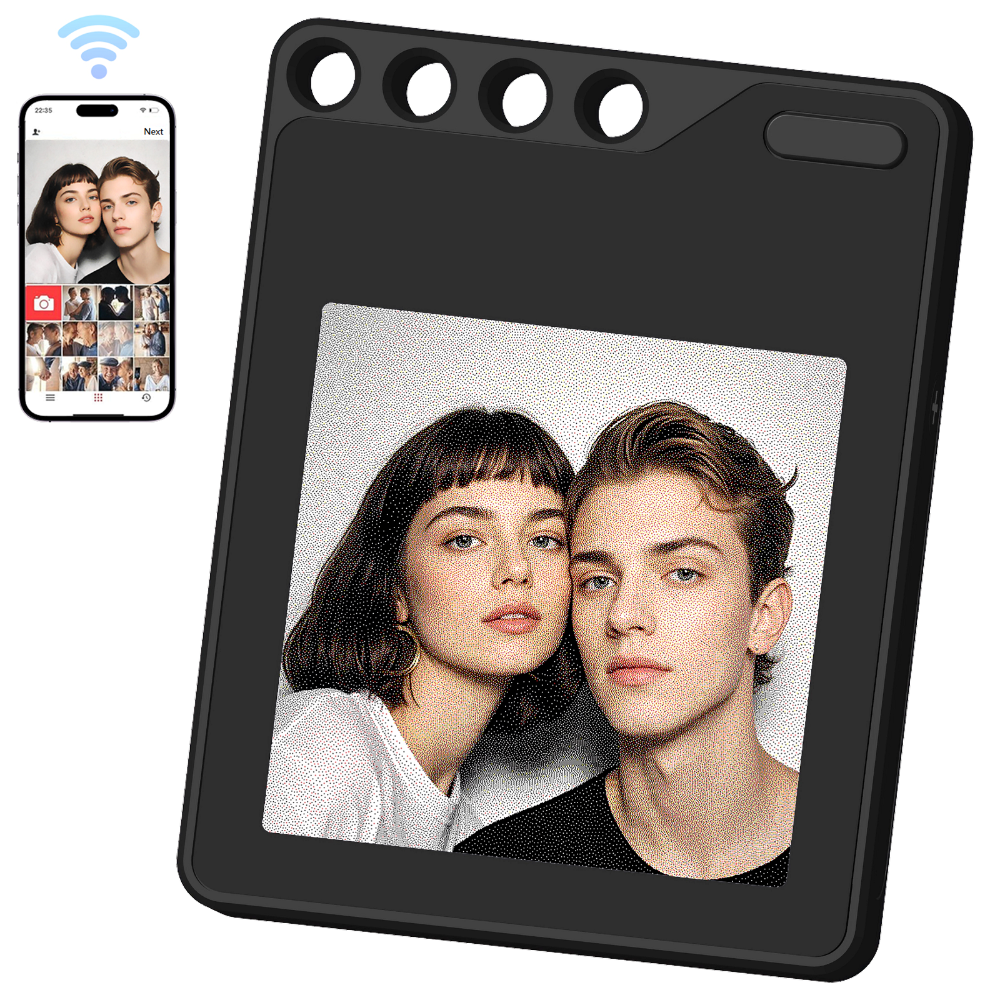
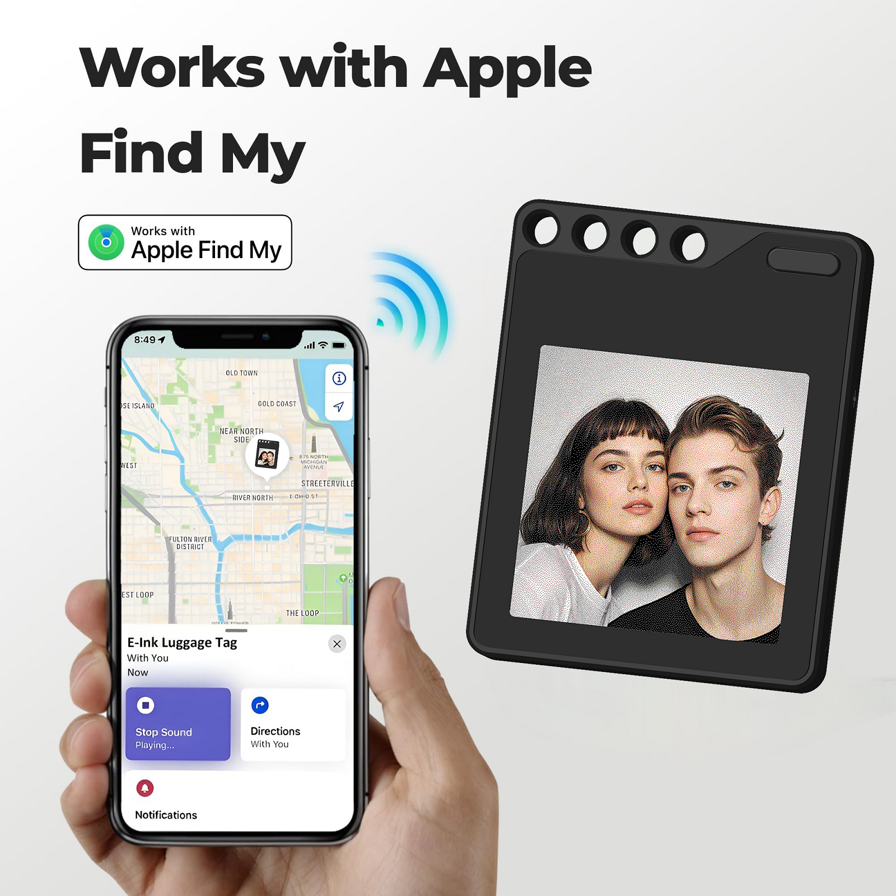
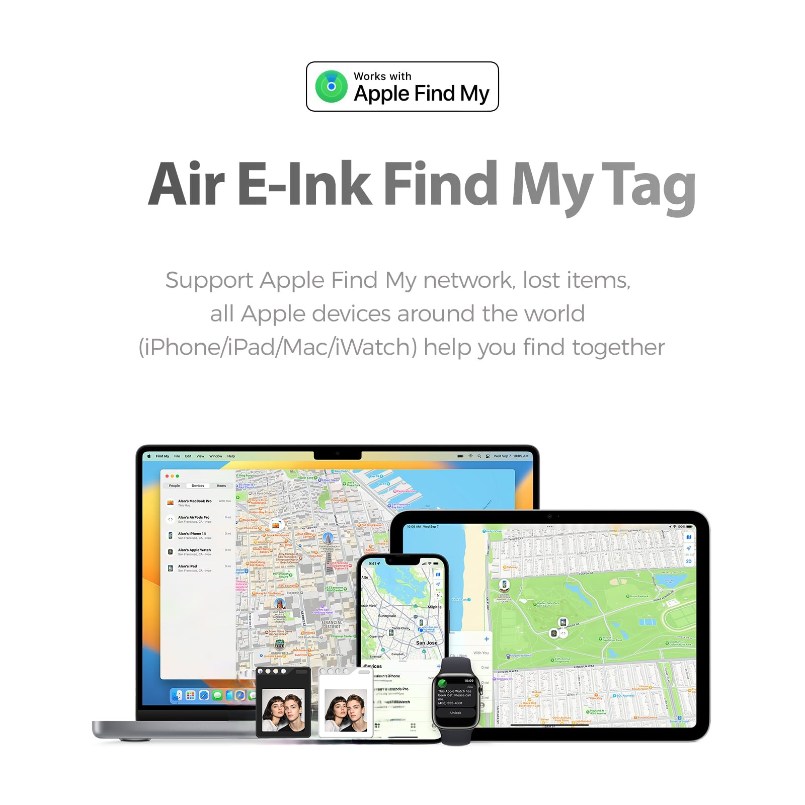
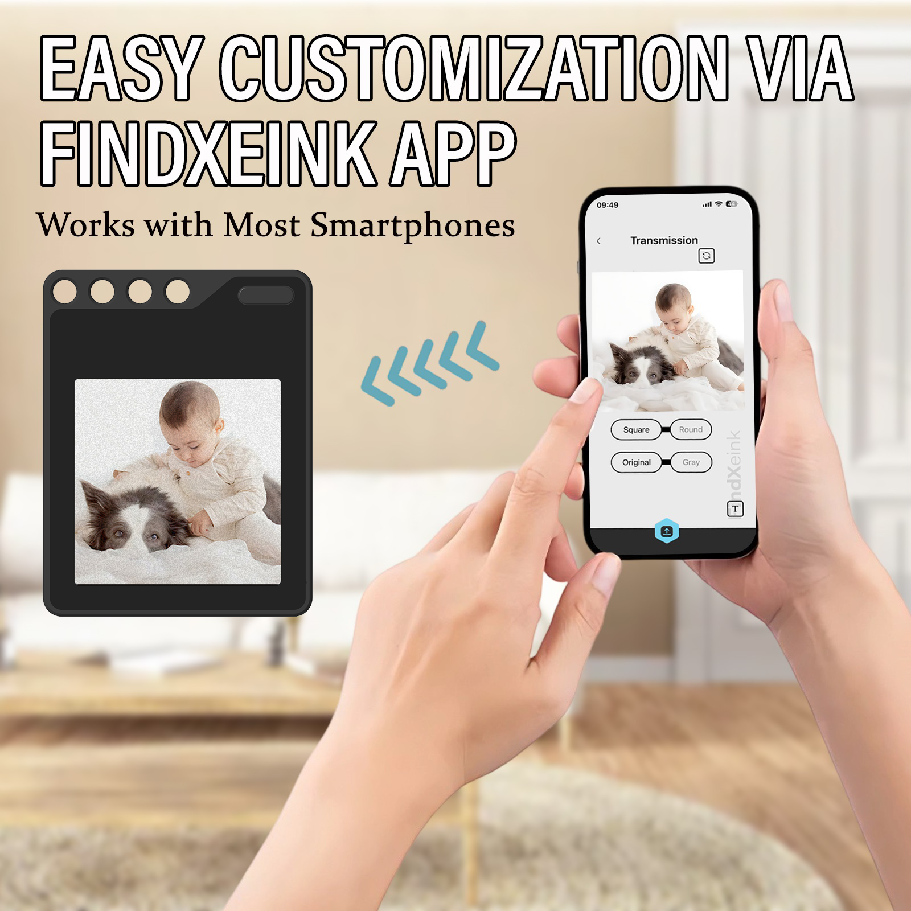
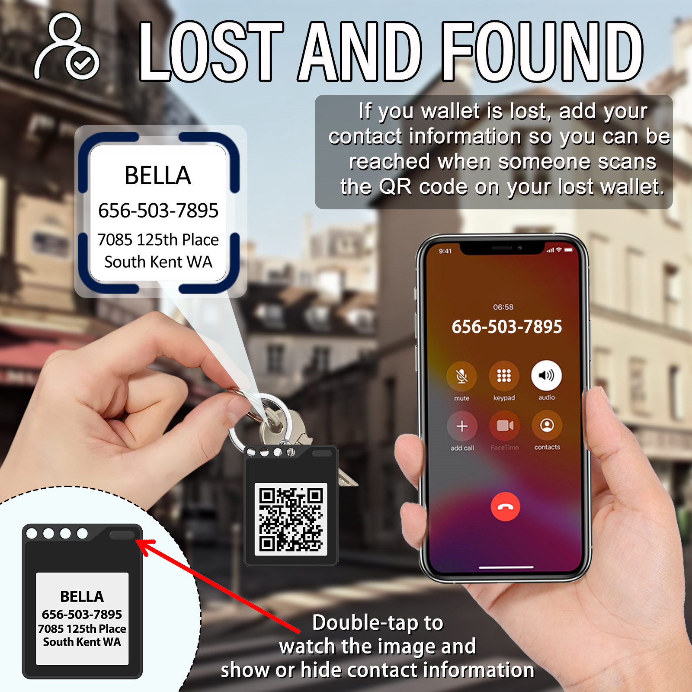
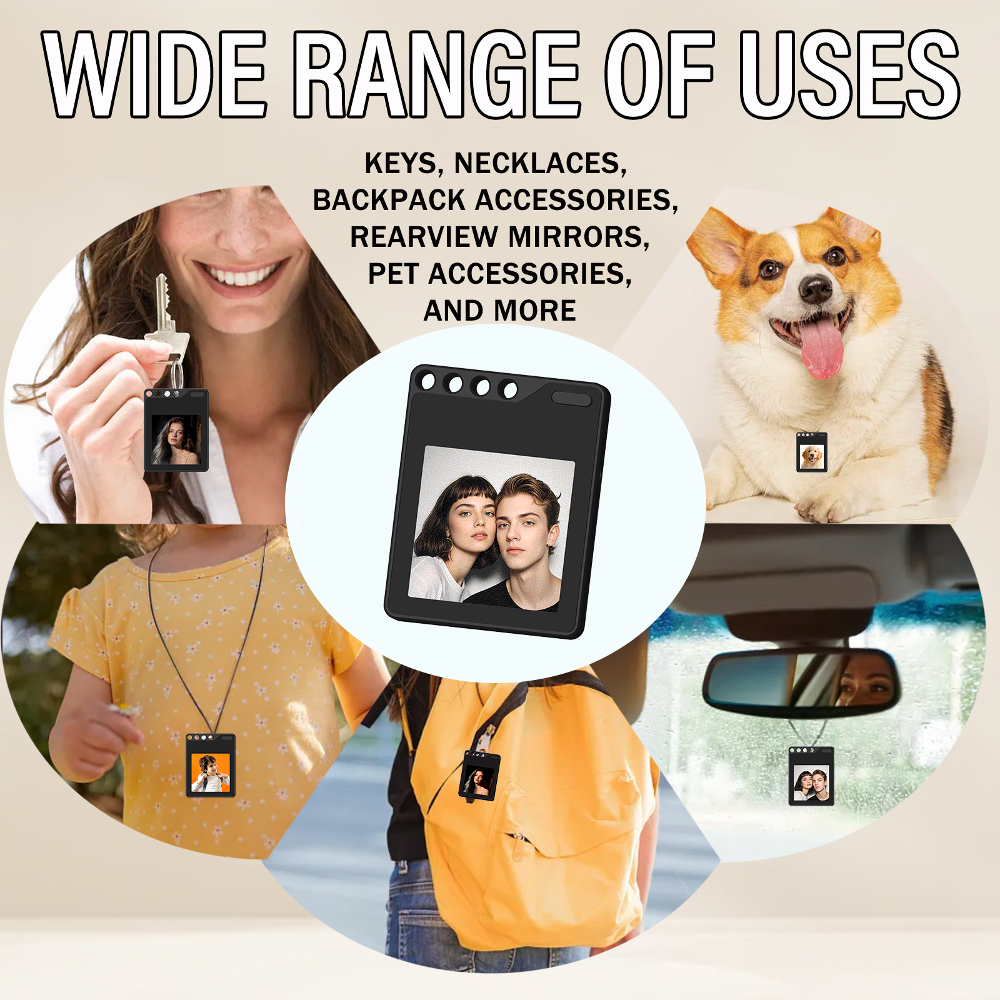
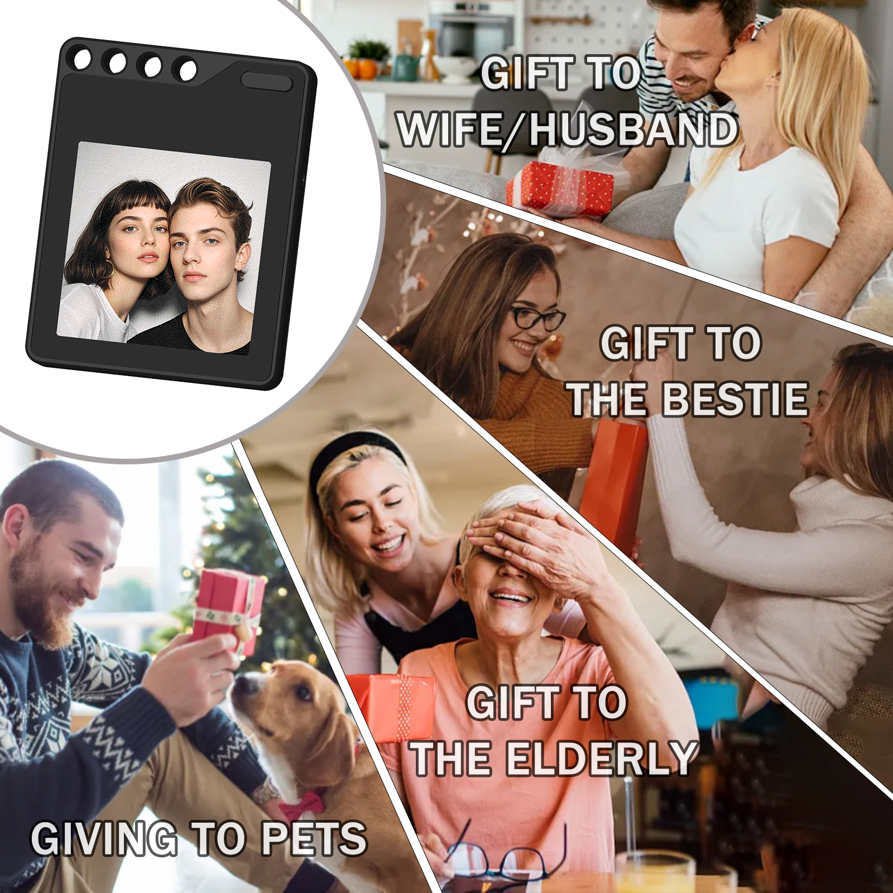
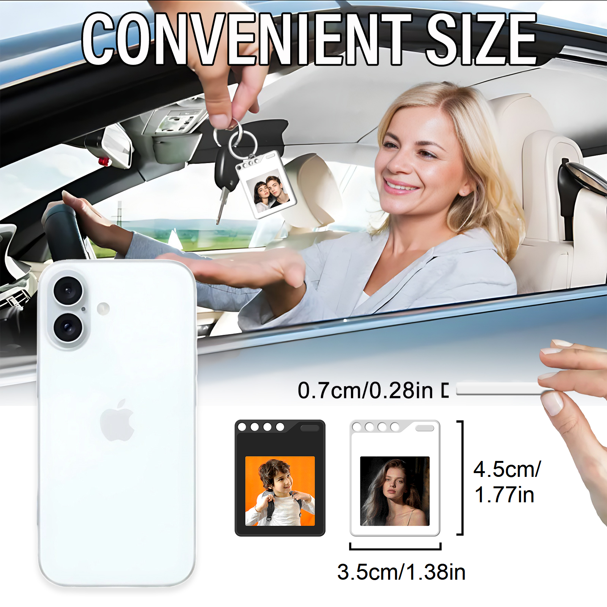

# F10 E-Ink Display Tag — Complete User Guide

> Bluetooth Photo Keychain with Apple Find My Support

---

## 📧 Contact

**Email:** sales@icbbuy.com

---

## 🖼️ Product Gallery

| | | |
|:---:|:---:|:---:|
|  |  |  |
| **001** | **002** | **003** |
|  |  |  |
| **004** | **005** | **006** |
|  |  |  |
| **007** | **008** | **009** |

---

## 📦 Product Overview

The **F10 E-Ink Display Tag** is a smart Bluetooth photo keychain featuring advanced electronic ink screen technology. It displays your most precious photos while supporting the Apple Find My network, ensuring your important items are never lost.

**Use cases:** Keychain · Pet Tag · Backpack Charm · Car Decoration · Luggage Tag

---

## ✨ Core Features

| Feature | Details |
|---------|---------|
| Screen | 1.54" HD E-Ink, 200×200 resolution |
| Size | 3.5cm × 4.5cm × 0.7cm (1.38" × 1.77" × 0.28") |
| Connectivity | Bluetooth (FindXeink App) |
| Tracking | Apple Find My network support |
| Battery | CR2025 button cell, 3–6 months life |
| Shell | Premium ABS, available in Black / White |
| Splash Resistance | Splash-resistant (not fully waterproof) |

---

## 📱 App: FindXeink

Download the **FindXeink** app to manage your device:

- **iOS** → Apple App Store
- **Android** → Google Play Store

---

## 🚀 Quick Start

### 1. Battery Installation

1. Open the battery compartment on the back
2. Insert CR2025 battery — **positive (+) side facing up**
3. Close the cover securely
4. Press the power button to turn on

### 2. Pair with Your Phone

1. Open FindXeink app → enable Bluetooth
2. Tap **"Add Device"** or **"+"**
3. Press the power button on the tag to enter pairing mode
4. Select your device from the list
5. Wait for connection confirmation

> 💡 Keep the tag within **10 meters** of your phone for best connectivity.

### 3. Upload a Photo

1. Open FindXeink → tap **"Photo Gallery"** or **"Upload Image"**
2. Select a photo from your gallery
3. Crop and adjust to fit the square display
4. Tap **"Upload"** → wait 10–15 seconds

---

## 🖼️ Photo Tips

For best display quality on the e-ink screen:

- ✅ High-contrast images with clear subjects
- ✅ Centered portrait photos
- ✅ Black & white images (excellent clarity)
- ❌ Avoid overly detailed or busy backgrounds
- ℹ️ Color photos are automatically converted to grayscale

**Storage:** Save up to 10–20 photos in the app library and switch between them anytime.

---

## 🔍 Lost & Found Feature

### Setup Contact Info

1. Open FindXeink → **"Lost & Found Settings"**
2. Enter your contact info (phone, email, custom message)
3. A QR code is automatically generated
4. Save settings

### How to Use

- **Double-tap** the screen → switches from photo to contact info + QR code
- **Double-tap again** → returns to photo

> If someone finds your lost item, they can scan the QR code to contact you.

---

## 📍 Apple Find My Setup

### Requirements
- iPhone / iPad with **iOS 14.5 or later**
- Apple ID

### Setup Steps

1. Open the **Find My** app on your iPhone
2. Tap **"Items"** tab → **"Add Item"**
3. Select **"Other Supported Item"**
4. Follow on-screen prompts to link to your Apple ID
5. Name your tag (e.g., "My Keys", "Travel Bag")

### What You Can Do

- 📍 View real-time location in Find My app
- 🔊 Play a sound to locate nearby items
- 🔔 Enable **Lost Mode** for location notifications
- 🗺️ Get directions to your tag's location
- 📜 View location history

---

## 🎯 Use Cases

### 🔑 Personalized Keychain
Display family photos, pet photos, or emergency contact info on your keys.

### 🐾 Smart Pet ID Tag
Show your pet's photo + contact info. Track location via Apple Find My if your pet gets lost.

### 🎒 Backpack / Bag Charm
Custom images, travel photos, easy identification at baggage claim.

### 🚗 Car Rearview Mirror
Display family or pet photos, change by mood or season.

### 🧳 Luggage Tag
Contact info for lost luggage recovery + Apple Find My tracking.

---

## 🔋 Battery & Power

| Item | Details |
|------|---------|
| Battery Type | CR2025 (or CR2026) button cell |
| Expected Life | 3–6 months (normal use) |
| Power Usage | Only consumes power when updating display |
| Auto Sleep | After 15 minutes of inactivity |
| Display Retention | Image stays visible without power |

### Replace Battery

1. Open battery compartment on the back
2. Remove old battery
3. Insert new CR2025/CR2026 — positive side up
4. Close compartment
5. Press power button to restart

---

## 🛠️ Troubleshooting

| Issue | Solution |
|-------|----------|
| Won't power on | Check battery installation; try a new battery; clean battery contacts |
| Bluetooth won't connect | Enable Bluetooth; stay within 10m; restart both devices |
| Image won't upload | Verify Bluetooth is active; try a simpler image; check format (JPG/PNG) |

---

## ❓ FAQ

**Q: Can I use it without a smartphone?**
Once an image is uploaded, it stays displayed indefinitely without a phone. A phone is only needed for setup and updating images.

**Q: Will the image fade over time?**
No. E-ink technology maintains the image without power — it stays clear until you update it.

**Q: Is it compatible with Android?**
Yes! The FindXeink app supports both iOS and Android. Apple Find My is iOS-only.

**Q: Is it waterproof?**
Splash-resistant — handles light rain and accidental splashes, but should not be submerged.

---

## 📐 Specifications

| Spec | Value |
|------|-------|
| Display | 1.54" E-Ink, 200×200 px |
| Dimensions | 3.5 × 4.5 × 0.7 cm |
| Weight | ~15g |
| Battery | CR2025 button cell |
| Battery Life | 3–6 months |
| Connectivity | Bluetooth |
| App | FindXeink (iOS & Android) |
| Tracking | Apple Find My |
| Shell | ABS plastic (Black / White) |
| Water Resistance | Splash-resistant |

---

*Carry your memories everywhere. Never lose what matters.*
